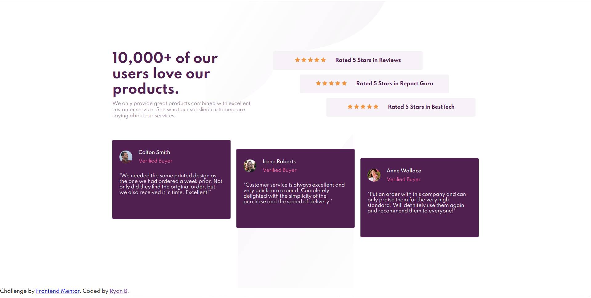

# Frontend Mentor - Social proof section

## Welcome! 👋

Thanks for checking out this front-end coding challenge.

[Frontend Mentor](https://www.frontendmentor.io) challenges allow you to improve your skills in a real-life workflow.

**To do this challenge, you need a basic understanding of HTML and CSS.**

## The challenge

Your challenge is to build out this social proof section and get it looking as close to the design as possible.

You can use any tools you like to help you complete the challenge. So if you've got something you'd like to practice, feel free to give it a go.

Your users should be able to:

- View the optimal layout for the section depending on their device's screen size

Want some support on the challenge? [Join our Slack community](https://www.frontendmentor.io/slack) and ask questions in the **#help** channel.

## Giving feedback

Feedback is always welcome, so if you have any to give on this challenge please email hi[at]frontendmentor[dot]io.

This challenge is completely free. Please share it with anyone who will find it useful for practice.

**Have fun building!** 🚀

## Community Sponsors

A massive thank you to our community sponsors!

- [Hack for NF](https://bit.ly/fem-bemyapp) is a perfect opportunity to write code, contribute to an amazing cause, meet others, and have fun all at the same time! The hackathon starts October 2nd and runs through to November 13th. Datasets, mentor support, and input from patients are all provided. There's also \$40K USD in prizes and grants up for grabs!
- [Diversify Tech](https://bit.ly/fem-diversify-tech) is an amazing resource for underrepresented people in tech. The site features job listings for anyone seeking new opportunities. The resource section is also full of useful links to dive into!
- [Zero to Mastery](https://bit.ly/fem-ztm) is an incredible learning resource for all things web development. Led by Andrei Neagoie, the courses are really high-quality content and cover a wide range of in-demand skills.
